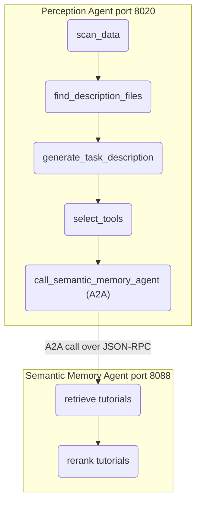

# Perception Agent (A2A Protocol)

Standalone, self-contained perception agent for the FAME framework, exposed as an A2A-compliant service.

---

## Architecture



### Nodes

| # | Node | Description |
|---|------|-------------|
| 1 | `scan_data` | Scans input folder, groups files, reads content via LLM-generated Python scripts |
| 2 | `find_description_files` | Uses LLM to identify README/description files from the data prompt |
| 3 | `generate_task_description` | Generates a concise ML task description from data + description files |
| 4 | `select_tools` | Ranks ML libraries from the bundled tool registry |
| 5 | `call_semantic_memory_agent` | Calls the Semantic Memory Agent via A2A for tutorial retrieval & reranking |

---

## Directory Layout

```
Perception_agent/
├── a2a_server.py          # A2A entry point (port 8020)
├── agent.py               # LangGraph graph builder
├── state.py               # PerceptionAgentState TypedDict
├── utils.py               # Self-contained helpers (LLM, files, registry, A2A client)
├── prompts.py             # Prompt templates
├── __init__.py            # Package exports
├── requirements.txt       # Dependencies
├── tools_registry/        # Bundled tool catalog (self-contained)
│   ├── _common/
│   │   └── catalog.json
│   ├── autogluon.tabular/
│   ├── autogluon.multimodal/
│   └── ...
└── README.md              # This file
```

---

## Server Setup & Usage

### Prerequisites

You need a Python environment with the required dependencies installed (e.g. `mlauto` conda environment), and an OpenAI API key.

```bash
# 1. Activate your environment
conda activate mlauto

# 2. Export your API key
export OPENAI_API_KEY=sk-...
```

### Step 1: Start the Semantic Memory Agent

The Perception Agent requires the Semantic Memory Agent to be running on port `8088` to fetch tutorials.

Open a new terminal:
```bash
conda activate mlauto
export OPENAI_API_KEY=sk-...

cd /path/to/FAME/agents/semantic_agent
python a2a_server.py
```

### Step 2: Start the Perception Agent

Open another terminal:
```bash
conda activate mlauto
export OPENAI_API_KEY=sk-...

cd /path/to/FAME/agents/Perception_agent
python a2a_server.py
```

The server starts on `http://127.0.0.1:8020` and exposes:
- `/.well-known/agent-card.json` — Agent Card discovery
- `/` — JSON-RPC 2.0 endpoint

---

## Integration with MLorchestrator

The MLorchestrator calls this agent's `analyze_task` skill at `http://localhost:8020`. Configure in `MLorchestrator/config.yaml`:

```yaml
a2a_agents:
  perception_url: "http://localhost:8020"
```

---

## Configuration

The agent accepts configuration via the `config` field in the A2A message:

| Key | Default | Description |
|-----|---------|-------------|
| `config.llm.model` | `gpt-4o` | LLM model for perception tasks |
| `config.llm.temperature` | `0.1` | LLM temperature |
| `config.tool_registry_path` | `./tools_registry` | Path to tool catalog |
| `config.a2a_agents.semantic_memory_url` | `http://localhost:8088` | Semantic Memory Agent URL |

---

## Standalone Deployment

This agent is designed as a **completely self-contained black box**:
- No imports from MLauto, FAME, or any external agent modules
- Bundled `tools_registry/` for tool catalog lookups
- Own A2A client for Semantic Memory Agent communication
- Can be deployed independently (e.g., in AWS Lambda, Docker, etc.)

---

## 📊 Metrics & Logger Integration

The Perception Agent features unified metrics and logging instrumentation using the **`common_local`** library. It tracks execution characteristics through several key events:
- **`llm_call`**: Captures LLM invocation latency, input/output tokens (with reasoning and cached details), byte estimates, and provider-side processing duration (e.g., `openai-processing-ms`).
- **`psutil_metrics_node`**: Approximates peak memory (RAM) usage and execution time per individual LangGraph node.
- **`psutil_metrics_graph`**: Records the end-to-end memory usage, steps, and execution duration of the overall graph.

### Running the Standalone Test Runner with Logging
A local verification runner is available at [test/run.py](test/run.py) which builds mock datasets and executes the graph. To run locally:
```bash
uv run python agents/Perception_agent/test/run.py
```
This writes raw logs to `agents/Perception_agent/test/logs/<timestamp>/metrics.jsonl`.

### Aggregating Metrics Logs
Logs can be grouped and split by event type using the `aggregate_logs.py` utility:
```bash
uv run python agents/Perception_agent/aggregate_logs.py agents/Perception_agent/test/logs/your_run_timestamp/metrics.jsonl -o agents/Perception_agent/test/logs/your_run_timestamp/
```

This aggregates and exports the logs into:
- `metrics.json`: Raw JSON events.
- `debug.json`: LLM invocation debug details.
- `llm_call.json`: Structured LLM metrics.
- `psutil.json`: Node-level and graph-level performance statistics.

