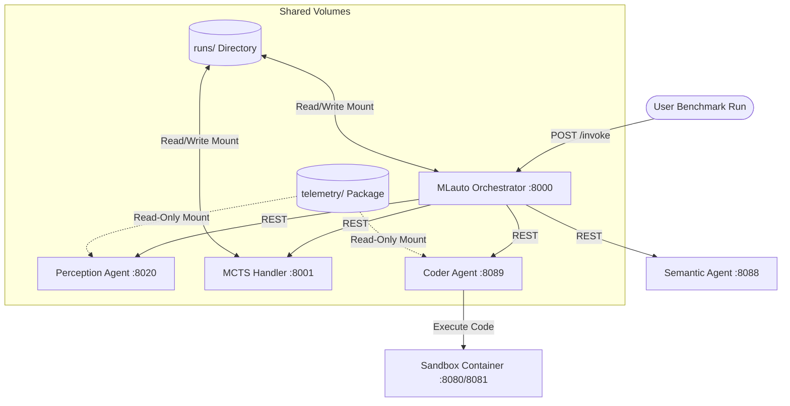

# MLauto: Local Microservices-Based AutoML Platform

MLauto is a powerful, highly isolated, local microservices-based AutoML platform. It leverages a Monte Carlo Tree Search (MCTS) control loop to coordinate specialized agents—Perception, Semantic, and Coder—to automatically explore, optimize, and build machine learning pipelines on tabular and multimodal datasets.

Initially derived from a complex cloud-based lambda setup, the repository has been completely refactored into a lightweight, standard local Docker-compose stack utilizing pure, high-performance FastAPI microservices.

---

## 🏗️ Architecture Overview

The platform is designed around strictly isolated microservices communicating synchronously via HTTP REST (`POST /invoke`). There are no cross-imports or direct package dependencies between agent directories.



### Key Components

1. **MLauto Orchestrator (`mlorchestrator/`)**: The main gateway that coordinates the AutoML search loop. It initializes the workspace, directs the agents, and compiles final telemetry logs.
2. **MCTS Handler (`mcts_handler/`)**: Maintains and serializes the search tree during the AutoML optimization phase, managing the selection, expansion, evaluation, and backpropagation of modeling nodes.
3. **Perception Agent (`Perception_agent/`)**: Automatically analyzes dataset schemas, files, and shapes inside the sandbox to construct modeling task guidelines.
4. **Semantic Agent (`semantic_agent/`)**: Resolves error logs and fetches relevant technical tutorials or reference models using local embedding lookups (BGE models).
5. **Coder Agent (`coder_agent/`)**: Writes high-quality machine learning training scripts (e.g., using AutoGluon) and wrapper bash scripts to execute them inside the sandbox.
6. **Sandbox (`local/SandboxDockerfile`)**: An isolated environment that acts as the model-training playground.
7. **Telemetry (`telemetry/`)**: A standardized, unified core logging package containing `metrics_context.py`, `metrics_emitter.py`, and `logging_callback.py`, mounted dynamically as a shared read-only Docker volume inside agent runtimes.

---

## ⚡ Key Features & Refactoring Highlights

* **FastAPI Runtimes**: Purged all legacy cloud-specific wrappers, bastions, and cloud MCP packages. All agent servers are now pure, highly efficient FastAPI microservice runtimes.
* **Singleton LangGraphs**: Graphs are compiled exactly once at container startup, eliminating per-request graph recompilation lag and accelerating step performance.
* **Host-to-Container Security Boundary**: All container runtimes and the sandbox execute under the host's non-root user permissions (`1000:1000`). All output directories and logs in `runs/` are created with correct host user permissions, eliminating `PermissionError` blockages.
* **Zero-Argument Sandboxed Bash Execution**: The Coder Agent is strictly instructed to generate self-contained bash scripts (avoiding command-line argument expectations like `$1`), ensuring robust execution within the isolated sandbox environment.
* **Presentation-Grade FAME++ Telemetry Plots**: Overhauled the telemetry plotting script to generate beautiful, publication-ready line and stacked bar charts detailing the run sequence (Slide 40 & 41 style), completely separating Orchestrator gaps from MCTS Handler operations.

---

## 📁 Repository Structure

```
MLauto/
├── coder_agent/         # Code writing agent FastAPI service
├── mcts_handler/        # MCTS loop tree management FastAPI service
├── mlorchestrator/      # Orchestrator gateway service
├── Perception_agent/    # Sandbox dataset analysis service
├── semantic_agent/      # Retrieval-augmented error analysis service
├── telemetry/           # Shared read-only logging core volume
├── tools_registry/      # Reference tools configurations & instructions
├── local/               # Docker configuration and execution scripts
│   ├── docker-compose.yml
│   ├── run_local.sh     # Primary stack startup & benchmark runner
│   ├── config.json      # Configuration parameters
│   └── plot_telemetry.py # Presentation plotting engine
└── runs/                # Local log database & runs (ignored in git)
```

---

## 🚀 Getting Started

### Prerequisites
* Docker & Docker Compose
* Python 3.10+ (on host for plotting/running benchmarks)

### Running the Stack
To boot the local microservices, construct the containers, and run the tabular dataset benchmark:

```bash
# 1. Navigate to the local docker environment
cd local

# 2. Stop any existing running stack
docker compose down

# 3. Spin up the stack and run the benchmark (includes 30s stack initialization delay)
./run_local.sh
```

### Clean Up
To cleanly spin down the docker stack and free system ports:
```bash
cd local
docker compose down
```

---

## 📊 Telemetry and Visualizations

At the end of a benchmark run, the platform parses `orchestrator_telemetry.jsonl` and `coder_metrics.jsonl` to output high-fidelity graphs inside the run folder:

1. **`execution_timeline.png`**: A sequential line chart mapping cumulative execution latency (in minutes) against the step sequence. Distinguishes between internal **Orchestrator** operations and **MCTS Handler** steps.
2. **`node_time_breakdown.png`**: A stacked bar chart showing exact time breakdowns (LLM calls, File Write, Shell executions) for each span.
